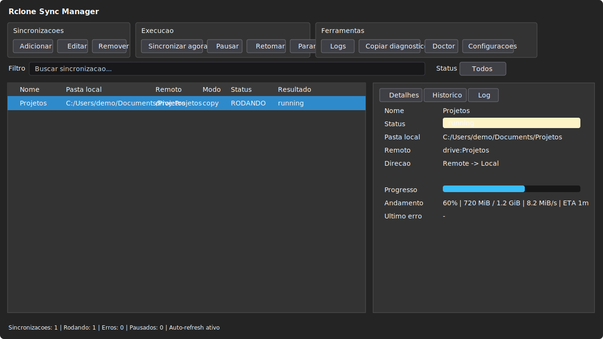
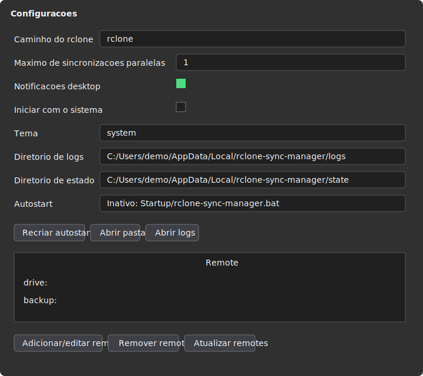
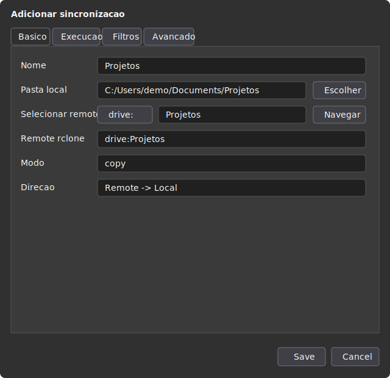

# Rclone Sync Manager

[](https://github.com/rafaelsoje/rclone-sync-manager/actions/workflows/tests.yml)
[](LICENSE)

Aplicativo desktop para gerenciar sincronizações locais usando `rclone`, com suporte a
Linux e Windows.

Ele oferece GUI em PySide6, tray icon, CLI `rsm`, fila de execução, watcher realtime,
agendamento simples, logs por job, histórico em SQLite, autostart da tray e integração
opcional com `systemd --user` no Linux.

## Screenshots

As imagens abaixo usam dados de exemplo, sem caminhos, nomes de usuario ou remotes reais.







## Requisitos

- Linux com sessão desktop ou Windows 10/11.
- Python 3.11 ou superior.
- `rclone` instalado e configurado.
- Acesso ao `systemd --user` no Linux se quiser rodar o serviço em background.

No Arch Linux, por exemplo:

```bash
sudo pacman -S python rclone
```

## Instalação No Linux

No Linux, não compile o projeto. Ele é instalado em uma virtualenv local do próprio
repositório.

Não use `sudo` para a instalação normal:

```bash
./scripts/install.sh
```

O instalador pode ser chamado de qualquer diretório:

```bash
"/caminho/para/rclone sync manager/scripts/install.sh"
```

O instalador faz:

- cria ou recria `.venv` se estiver inválida ou tiver sido movida;
- instala dependências Python dentro da `.venv`;
- instala o pacote em modo editável;
- cria o comando `~/.local/bin/rsm`;
- adiciona `~/.local/bin` ao `PATH` da sua shell se ainda não estiver configurado;
- inicializa os diretórios e banco do app;
- instala o serviço de usuário em `~/.config/systemd/user/rclone-sync-manager.service`;
- cria o atalho do menu em `~/.local/share/applications/rclone-sync-manager.desktop`;
- instala o ícone em `~/.local/share/icons/hicolor/scalable/apps/rclone-sync-manager.svg`.

Depois da instalação, abra pelo menu de aplicativos procurando por:

```text
Rclone Sync Manager
```

Ou rode pelo terminal:

```bash
rsm gui
```

Se `rsm` não for encontrado no terminal atual logo após instalar, abra um novo terminal
ou recarregue o perfil indicado pelo instalador, por exemplo:

```bash
source ~/.zshrc
```

No Windows, use o modo direto com `run.ps1`. Ele cria a `.venv`, instala as dependências
e executa o app sem instalar atalhos globais.

## Rodar Sem Instalar

Para testar direto do repositório no Linux, use:

```bash
./run.sh
```

No Windows, pelo PowerShell:

```powershell
.\run.ps1
```

Se a execução de scripts estiver bloqueada, ou se você estiver no CMD, chame via
`powershell.exe`:

```cmd
powershell -ExecutionPolicy Bypass -File .\run.ps1
```

O `run.sh` e o `run.ps1` também podem ser chamados de qualquer diretório. Eles resolvem
o caminho real do script, recriam `.venv` se necessário, instalam dependências ausentes
e abrem a GUI.

Exemplos:

```bash
./run.sh --help
./run.sh doctor
./run.sh gui
```

Equivalentes no Windows:

```powershell
.\run.ps1 --help
.\run.ps1 doctor
.\run.ps1 gui
```

No CMD, use:

```cmd
powershell -ExecutionPolicy Bypass -File .\run.ps1 --help
powershell -ExecutionPolicy Bypass -File .\run.ps1 doctor
powershell -ExecutionPolicy Bypass -File .\run.ps1 gui
```

## Privilégio Elevado No Linux

A instalação normal no Linux não precisa de privilégio elevado porque grava apenas no seu
usuário:

```text
~/.local/bin
~/.local/share/applications
~/.local/share/icons
~/.config/systemd/user
~/.config/rclone-sync-manager
~/.local/share/rclone-sync-manager
```

Para instalar o `.desktop` globalmente em `/usr/share/applications`, aí sim precisa de
`sudo`. Isso é opcional; o atalho em `~/.local/share/applications` já aparece no menu de
aplicativos para o seu usuário.

Instalação global manual do launcher:

```bash
sudo install -Dm644 ~/.local/share/applications/rclone-sync-manager.desktop \
  /usr/share/applications/rclone-sync-manager.desktop

sudo install -Dm644 ~/.local/share/icons/hicolor/scalable/apps/rclone-sync-manager.svg \
  /usr/share/icons/hicolor/scalable/apps/rclone-sync-manager.svg
```

## Iniciar Com o Sistema

Existem dois jeitos diferentes de iniciar junto com o sistema.

### Tray Na Sessão Gráfica

Na GUI, abra `Configurações` e marque:

```text
Iniciar com o sistema
```

Isso cria:

```text
~/.config/autostart/rclone-sync-manager.desktop
```

No Windows, cria `rclone-sync-manager.bat` na pasta Startup do usuário.

Esse modo inicia o app na tray quando você entra na sessão gráfica.

### Serviço Em Background

No Linux, para rodar o loop em background via `systemd --user`:

```bash
systemctl --user enable --now rclone-sync-manager.service
```

Comandos úteis:

```bash
rsm service-status
rsm enable-service
rsm disable-service
```

O serviço executa:

```bash
rsm start
```

Ele inicia fila, realtime watchers, scheduler diário e jobs marcados com
`Executar ao iniciar`.

## Uso Pela Interface

No Linux instalado, abra:

```bash
rsm gui
```

No Windows, pelo repositório:

```powershell
.\run.ps1 gui
```

Na interface você pode:

- adicionar, editar, remover, pausar, retomar e executar jobs;
- abrir logs;
- copiar diagnóstico do job, incluindo comando, status, último erro e trecho final do log;
- exportar e importar jobs em JSON;
- navegar pelos remotes do `rclone`;
- copiar o comando `rclone` de um job;
- diagnosticar dependências com o botão `Doctor`;
- configurar autostart da tray;
- abrir diretórios de configuração, dados e logs pelas configurações;
- acompanhar status, progresso, histórico e log recente.

O tamanho e a posição da janela principal são salvos automaticamente ao fechar o app.

Ao criar um job novo, por padrão:

- `Executar ao iniciar` vem marcado;
- `Iniciar sincronização ao salvar` vem marcado.

Para iniciar apenas tray e runtime, sem mostrar a janela principal:

```bash
rsm gui --start-hidden
```

No Windows:

```powershell
.\run.ps1 gui --start-hidden
```

## Criar Jobs Pela CLI

Upload local para remote:

```bash
rsm add-job \
  --name Documentos \
  --local /home/rafael/Documentos \
  --remote gdrive:Documentos \
  --mode copy
```

Download do remote para pasta local:

```bash
rsm add-job \
  --name RestaurarDocumentos \
  --local /home/rafael/Documentos \
  --remote gdrive:Documentos \
  --mode copy \
  --direction remote-to-local
```

Em jobs `remote-to-local`, se a pasta local ainda não existir, o app cria a pasta
automaticamente. Em jobs `local-to-remote`, a pasta local precisa existir porque ela é a
origem da sincronização.

Comandos do dia a dia:

```bash
rsm list
rsm status
rsm run --job Documentos
rsm logs --job Documentos
rsm export-jobs jobs.json
rsm import-jobs jobs.json
```

No Windows sem instalação global, chame a CLI pelo `run.ps1`, por exemplo:

```powershell
.\run.ps1 list
.\run.ps1 run --job Documentos
```

Para a primeira execução de um job `bisync`:

```bash
rsm init-bisync --job Documentos
```

## Opções De Job

Direção:

- `local -> remote`: usa watcher local com `watchdog` quando realtime está ativo.
- `remote -> local`: usa polling do remote via `rclone lsf`.

Paralelismo padrão:

```text
Transfers: 4
Checkers: 8
```

Limite de banda:

```text
Sem limite
512K
1M
2M
10M
50M
```

Padrões ignorados aceitam filtros do `rclone`. Exemplo:

```text
*.tmp
*.temp
*.part
*.crdownload
~*
~$*
*.swp
*.swo
*.swx
.~lock.*#
.nfs*
.DS_Store
Desktop.ini
desktop.ini
Thumbs.db
thumbs.db
ehthumbs.db
$RECYCLE.BIN/**
System Volume Information/**
.Trash/**
.Trash-*/**
node_modules/**
__pycache__/**
vendor/**
storage/logs/**
```

`.git/**` não é ignorado por padrão para preservar histórico, branches, stashes e commits
locais que talvez ainda não tenham sido enviados para um remote Git.

## Troubleshooting

### PowerShell bloqueia `.ps1`

Se o PowerShell bloquear `.\run.ps1` dizendo que a execução de scripts foi desabilitada,
isso é uma política do PowerShell, não um erro do app. Para rodar o app sem mudar a
política global:

```powershell
powershell -ExecutionPolicy Bypass -File .\run.ps1
```

### `rclone` não encontrado

Instale o `rclone` e confirme que ele está no `PATH`:

```powershell
rclone version
```

Na GUI, abra `Configurações` e ajuste `Caminho do rclone` se quiser usar um executável
específico.

### Remote não encontrado

Abra `Configurações` e clique em `Adicionar/editar remote`, ou rode:

```powershell
rclone config
```

Depois use `Atualizar remotes` na tela de configurações.

### `corrupted on transfer`

O `rclone` normalmente remove o arquivo parcial e tenta novamente. Se o erro persistir,
reduza `Transfers`/`Checkers`, confira a conexão, espaço em disco e se o destino local
está em uma unidade instável ou sincronizada por outro app.

### `Access is denied` ou `permission denied`

Confira permissões da pasta local, arquivos abertos em outro programa, antivírus, OneDrive
ou Google Drive montado. Tente rodar com uma pasta local comum, como `Documents`, para
isolar problema de permissão.

### Como pedir ajuda/debugar

Selecione o job e use `Copiar diagnostico`. Isso copia comando `rclone`, status, último
erro, caminho do log e o final do log recente.

## Desenvolvimento

Instalação manual para desenvolvimento:

```bash
python -m venv .venv
. .venv/bin/activate
python -m pip install -e . pytest
rsm init
rsm doctor
```

Rodar testes e checagens:

```bash
scripts/check.sh
```

No Windows:

```powershell
python -m venv .venv
.\.venv\Scripts\python.exe -m pip install -e . pytest
.\.venv\Scripts\python.exe -m rclone_sync_manager init
.\.venv\Scripts\python.exe -m rclone_sync_manager doctor
.\.venv\Scripts\python.exe -m pytest
```

`pytest` é dependência de desenvolvimento. O aplicativo roda sem ele.

## Desinstalação No Linux

```bash
./scripts/uninstall.sh
```

Isso remove:

- serviço systemd de usuário;
- link `~/.local/bin/rsm`;
- launcher do menu;
- ícone instalado pelo projeto.

Os dados de configuração e banco em `~/.config/rclone-sync-manager` e
`~/.local/share/rclone-sync-manager` não são apagados automaticamente.

No Windows, remova a pasta `.venv` do repositório se quiser limpar o ambiente local. Os
dados do app ficam em `%APPDATA%\rclone-sync-manager` e `%LOCALAPPDATA%\rclone-sync-manager`.
Se o autostart foi habilitado, remova `rclone-sync-manager.bat` da pasta Startup do
usuário.
